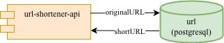

# Go URL Shortener, go!
This is a basic project to start with Go language. It's used to reduce long URLs to short ones.

## Tech stack
- Go language
- PostgreSQL
- Docker (for development purposes)

## Current system architecture



## Database set-up

To set up the database, run:

```
$ docker image build -t codecraftlabs/url-shortner-db:1.0.0 ./docker/postgres
$ docker container run --detach --name url-shortner-db --publish 5432:5432 codecraftlabs/url-shortner-db:1.0.0
```

## Build and run

To build and run the project, you need to have Go installed. Then, run:

```
$ go build
$ ./go-url-shortener
```

It will start the server on port 8080. Have fun.