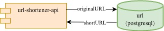

# Go URL Shortener, go!
This is a basic project to start with Go language. It's used to reduce long URLs to short ones.

## Tech stack
- Go 1.25 — standard library `net/http` only, no web framework (uses Go 1.22+ method-based route patterns like `GET /{shortCode}`)
- PostgreSQL, accessed through `database/sql` with the [`lib/pq`](https://github.com/lib/pq) driver
- [`sirupsen/logrus`](https://github.com/sirupsen/logrus) for structured JSON logging
- [`joho/godotenv`](https://github.com/joho/godotenv) for `.env`-based configuration
- Docker (for development purposes)

## Current system architecture



## Project layout

```
main.go        Entry point: loads config, opens the DB, wires dependencies, starts the HTTP server
config/        Configuration loading from environment variables / .env file
handlers/      HTTP layer: ApiHandler (redirect + shorten) and health check
shortener/     Service facade (UrlShortener) between handlers and the data layer
internal/      DB bootstrap (InitDB) and ShortUrlRepository (SQL queries + business logic)
base62/        Base62 encoding of numeric IDs into short codes
docker/        Dockerfile and init.sql for the development PostgreSQL instance
```

## Design notes

- **Dependency injection**: there are no package-level globals. `internal.InitDB` returns a `*sql.DB` handle, and `main` wires the chain explicitly: `*sql.DB` → `internal.NewShortUrlRepository` → `shortener.New` → `handlers.NewApiHandler`. This makes initialization order explicit and each layer testable in isolation.
- **Shortening algorithm**: IDs come from the PostgreSQL sequence `url_id` and are encoded to base62 (`[0-9A-Za-z]`), producing compact collision-free codes. Shortening is idempotent: submitting an already-known URL returns the existing short code by retrieving it from the database.
- **Connection pooling**: pool limits and connection lifetimes are tunable via environment variables (see below).
- **Graceful shutdown**: the server listens for `SIGINT`/`SIGTERM`, shuts down the HTTP server with a 10s timeout, then closes the DB pool. HTTP timeouts (read/write/idle/read-header) are set on the server.

## API

### `POST /shorten`
Creates (or returns an existing) short URL. Request bodies are limited to 64 KB.

```
$ curl -X POST http://localhost:8080/shorten \
    -H 'Content-Type: application/json' \
    -d '{"url": "https://example.com/some/very/long/path"}'
```

Response `201 Created`:
```json
{"url": "https://example.com/some/very/long/path", "shortUrl": "https://localhost:8080/1Z"}
```

Errors: `400` for an invalid body or a URL not starting with `http://`/`https://`, `500` on storage failures.

### `GET /{shortCode}`
Redirects to the original URL with `301 Moved Permanently`. Returns `404` for unknown codes.

### `GET /health`
Returns `200` with `{"status": "OK"}`.

## Configuration

Configuration is read from a `.env` file if present, falling back to system environment variables:

| Variable | Default | Description |
|---|---|---|
| `PORT` | `8080` | HTTP listen port |
| `DB_HOST` | `localhost` | PostgreSQL host |
| `DB_PORT` | `5432` | PostgreSQL port |
| `DB_USER` | `pguser` | Database user |
| `DB_PASSWORD` | `pgpwd` | Database password |
| `DB_NAME` | `urlshortener` | Database name |
| `DB_SSL_MODE` | `disable` | `sslmode` for the connection |
| `DB_MAX_OPEN_CONNECTIONS` | `25` | Max open connections in the pool |
| `DB_MAX_IDLE_CONNECTIONS` | `10` | Max idle connections in the pool |
| `DB_CONN_MAX_LIFETIME_MIN` | `30` | Max connection lifetime (minutes) |
| `DB_CONN_MAX_IDLE_TIME_MIN` | `10` | Max connection idle time (minutes) |

## Database set-up

The schema consists of a single `shortened_url` table plus the `url_id` sequence (see `docker/postgres/init.sql`):

| Column | Type | Notes |
|---|---|---|
| `id` | `bigint` | Primary key, taken from the `url_id` sequence |
| `url` | `varchar` | Original URL, unique |
| `short_url` | `varchar` | Base62 short code |
| `creation_date` | `timestamp with time zone` | When the record was created; defaults to `now()`, so the application does not set it explicitly |

To set up the database, run:

```
$ docker image build -t codecraftlabs/url-shortener-db:1.0.0 ./docker/postgres
$ docker container run --detach --name url-shortener-db --publish 5432:5432 codecraftlabs/url-shortener-db:1.0.0
```

## Build and run

To build and run the project, you need to have Go installed. Then, run:

```
$ go build
$ ./go-url-shortener
```

To run the tests:

```
$ go test ./...
```

It will start the server on port 8080 (or `PORT`). Have fun.