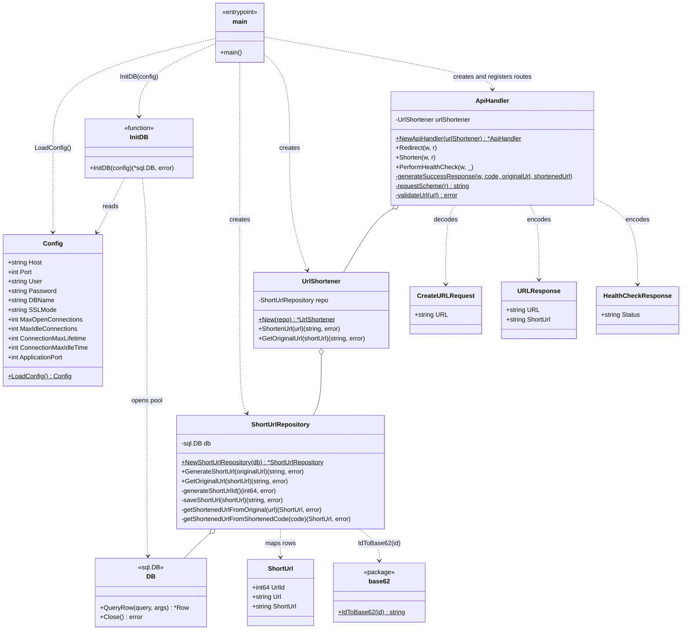
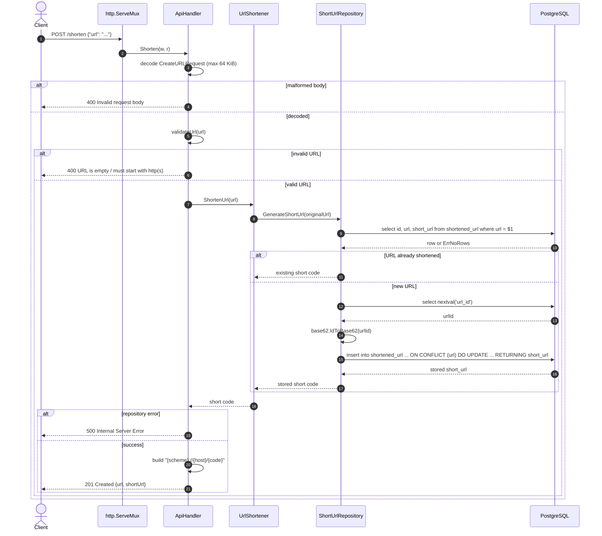
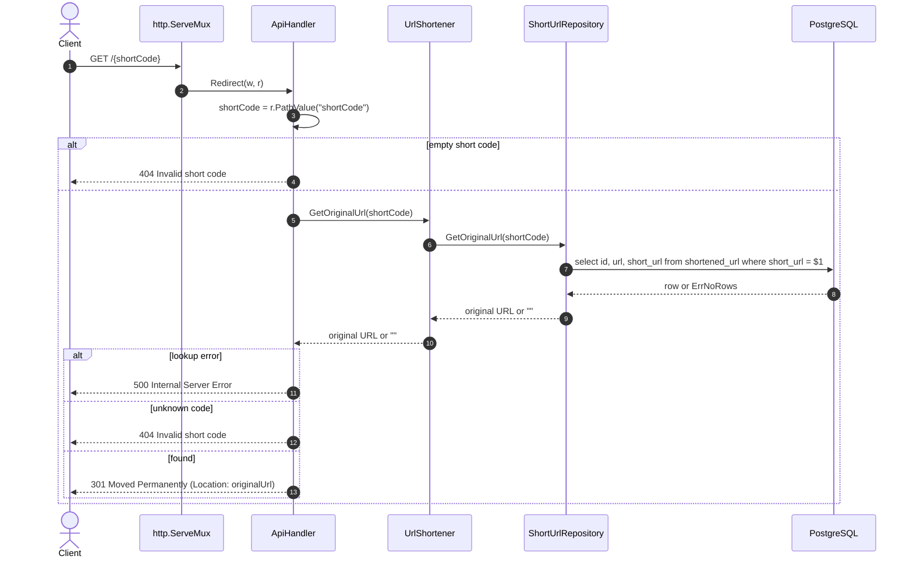
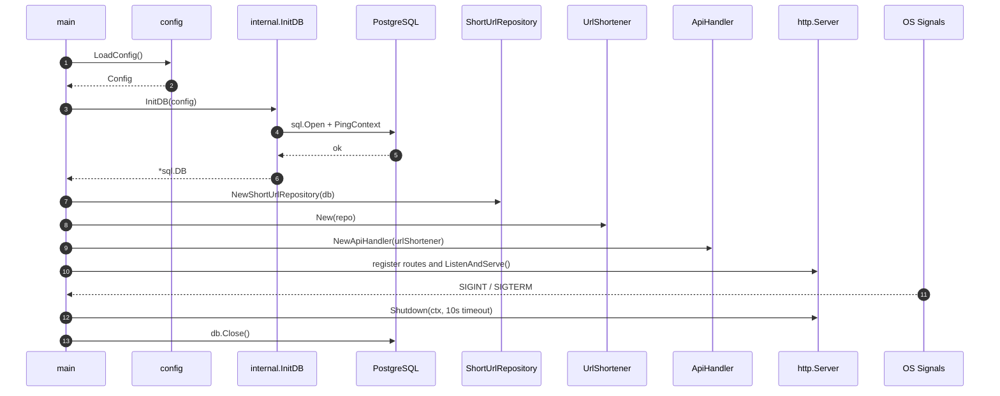

# Architecture Diagrams

## Class Diagram

```mermaid
classDiagram
    class Config {
        +string Host
        +int Port
        +string User
        +string Password
        +string DBName
        +string SSLMode
        +int MaxOpenConnections
        +int MaxIdleConnections
        +int ConnectionMaxLifetime
        +int ConnectionMaxIdleTime
        +int ApplicationPort
        +LoadConfig() Config$
    }

    class ApiHandler {
        -UrlShortener urlShortener
        +NewApiHandler(urlShortener) *ApiHandler$
        +Redirect(w, r)
        +Shorten(w, r)
        +PerformHealthCheck(w, _)
        -generateSuccessResponse(w, code, originalUrl, shortenedUrl)$
        -requestScheme(r) string$
        -validateUrl(url) error$
    }

    class CreateURLRequest {
        +string URL
    }

    class URLResponse {
        +string URL
        +string ShortUrl
    }

    class HealthCheckResponse {
        +string Status
    }

    class UrlShortener {
        -ShortUrlRepository repo
        +New(repo) *UrlShortener$
        +ShortenUrl(url) (string, error)
        +GetOriginalUrl(shortUrl) (string, error)
    }

    class ShortUrlRepository {
        -sql.DB db
        +NewShortUrlRepository(db) *ShortUrlRepository$
        +GenerateShortUrl(originalUrl) (string, error)
        +GetOriginalUrl(shortUrl) (string, error)
        -generateShortUrlId() (int64, error)
        -saveShortUrl(shortUrl) (string, error)
        -getShortenedUrlFromOriginal(url) (ShortUrl, error)
        -getShortenedUrlFromShortenedCode(code) (ShortUrl, error)
    }

    class ShortUrl {
        +int64 UrlId
        +string Url
        +string ShortUrl
    }

    class base62 {
        <<package>>
        +IdToBase62(id) string$
    }

    class DB {
        <<sql.DB>>
        +QueryRow(query, args) *Row
        +Close() error
    }

    class main {
        <<entrypoint>>
        +main()
    }

    class InitDB {
        <<function>>
        +InitDB(config) (*sql.DB, error)
    }

    main ..> Config : LoadConfig()
    main ..> InitDB : InitDB(config)
    main ..> ShortUrlRepository : creates
    main ..> UrlShortener : creates
    main ..> ApiHandler : creates and registers routes
    InitDB ..> Config : reads
    InitDB ..> DB : opens pool

    ApiHandler o-- UrlShortener
    ApiHandler ..> CreateURLRequest : decodes
    ApiHandler ..> URLResponse : encodes
    ApiHandler ..> HealthCheckResponse : encodes
    UrlShortener o-- ShortUrlRepository
    ShortUrlRepository o-- DB
    ShortUrlRepository ..> ShortUrl : maps rows
    ShortUrlRepository ..> base62 : IdToBase62(id)
```

## Sequence Diagram: POST /shorten

```mermaid
sequenceDiagram
    autonumber
    actor Client
    participant Mux as http.ServeMux
    participant H as ApiHandler
    participant S as UrlShortener
    participant R as ShortUrlRepository
    participant DB as PostgreSQL

    Client->>Mux: POST /shorten {"url": "..."}
    Mux->>H: Shorten(w, r)
    H->>H: decode CreateURLRequest (max 64 KiB)
    alt malformed body
        H-->>Client: 400 Invalid request body
    else decoded
        H->>H: validateUrl(url)
        alt invalid URL
            H-->>Client: 400 URL is empty / must start with http(s)
        else valid URL
            H->>S: ShortenUrl(url)
            S->>R: GenerateShortUrl(originalUrl)
            R->>DB: select id, url, short_url from shortened_url where url = $1
            DB-->>R: row or ErrNoRows
            alt URL already shortened
                R-->>S: existing short code
            else new URL
                R->>DB: select nextval('url_id')
                DB-->>R: urlId
                R->>R: base62.IdToBase62(urlId)
                R->>DB: insert into shortened_url ... ON CONFLICT (url) DO UPDATE ... RETURNING short_url
                DB-->>R: stored short_url
                R-->>S: stored short code
            end
            S-->>H: short code
            alt repository error
                H-->>Client: 500 Internal Server Error
            else success
                H->>H: build "{scheme}://{host}/{code}"
                H-->>Client: 201 Created {url, shortUrl}
            end
        end
    end
```

## Sequence Diagram: GET /{shortCode}

```mermaid
sequenceDiagram
    autonumber
    actor Client
    participant Mux as http.ServeMux
    participant H as ApiHandler
    participant S as UrlShortener
    participant R as ShortUrlRepository
    participant DB as PostgreSQL

    Client->>Mux: GET /{shortCode}
    Mux->>H: Redirect(w, r)
    H->>H: shortCode = r.PathValue("shortCode")
    alt empty short code
        H-->>Client: 404 Invalid short code
    else
        H->>S: GetOriginalUrl(shortCode)
        S->>R: GetOriginalUrl(shortCode)
        R->>DB: select id, url, short_url from shortened_url where short_url = $1
        DB-->>R: row or ErrNoRows
        R-->>S: original URL or ""
        S-->>H: original URL or ""
        alt lookup error
            H-->>Client: 500 Internal Server Error
        else unknown code
            H-->>Client: 404 Invalid short code
        else found
            H-->>Client: 301 Moved Permanently (Location: originalUrl)
        end
    end
```

## Sequence Diagram: Startup and Graceful Shutdown

```mermaid
sequenceDiagram
    autonumber
    participant M as main
    participant C as config
    participant I as internal.InitDB
    participant DB as PostgreSQL
    participant R as ShortUrlRepository
    participant S as UrlShortener
    participant H as ApiHandler
    participant Srv as http.Server
    participant OS as OS Signals

    M->>C: LoadConfig()
    C-->>M: Config
    M->>I: InitDB(config)
    I->>DB: sql.Open + PingContext
    DB-->>I: ok
    I-->>M: *sql.DB
    M->>R: NewShortUrlRepository(db)
    M->>S: New(repo)
    M->>H: NewApiHandler(urlShortener)
    M->>Srv: register routes and ListenAndServe()
    OS-->>M: SIGINT / SIGTERM
    M->>Srv: Shutdown(ctx, 10s timeout)
    M->>DB: db.Close()
```
